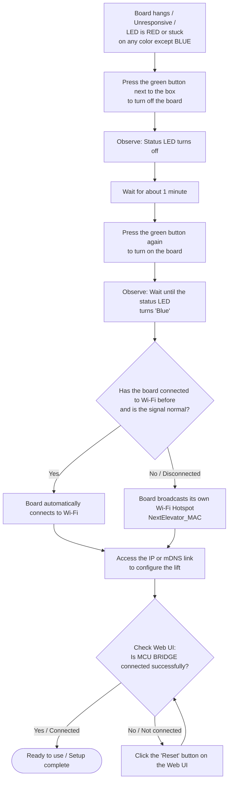

# Arduino UNO Q Elevator Controller (`main.py`) - System Manual

This document provides a comprehensive operational and technical manual for the Arduino UNO Q Elevator Controller application implemented in [`main.py`](main.py).

---

## 1. System Overview & Architecture

`main.py` implements a **Dual-Modbus Bridge Architecture** designed to interface an MPU (Linux Host) with an MCU (Arduino + Zephyr RTOS) and an Autonomous Mobile Robot (AMR / AGV) or Central Elevator Controller.

```text
               +---------------------------------------------------+
               |             Robot / Central Controller             |
               +-------------------------+-------------------------+
                                         |
                                         | Modbus TCP (Port 502)
                                         v
+---------------------------------------------------------------------------------+
| MPU Layer (Flask & Python Engine - main.py)                                      |
|                                                                                 |
|  +---------------------------+       +---------------------------------------+  |
|  | Modbus Client (Port 502)  |       | Modbus Server (Port 1502)             |  |
|  | - Scans call_target       |       | - Listens on 0.0.0.0:1502             |  |
|  | - Updates status/door     |       | - Receives local PLC/scada commands   |  |
|  +-------------+-------------+       +-------------------+-------------------+  |
|                |                                         |                      |
|                +--------------------+--------------------+                      |
|                                     |                                           |
|  +----------------------------------v----------------------------------------+  |
|  | State Machine & Mission Scanner (Sequence & Watchdog)                     |  |
|  +----------------------------------+----------------------------------------+  |
|                                     |                                           |
|  +----------------------------------v----------------------------------------+  |
|  | Flask HTTP Web Server & REST API (Port 5000) / mDNS Service              |  |
|  +----------------------------------+----------------------------------------+  |
|                                     |                                           |
|                                     | UNIX Socket MessagePack RPC               |
|                                     | (/var/run/arduino-router.sock)            |
+-------------------------------------|-------------------------------------------+
                                      |
                                      v
+---------------------------------------------------------------------------------+
| MCU Layer (Arduino UNO Q / Zephyr RTOS)                                         |
| - Relay / Solenoid Control (UP/DOWN)                                            |
| - Button LED Indicator Control                                                  |
| - Physical Door Sensor Monitoring (A1 / A4)                                     |
| - WS2812B RGB Status Lighting                                                   |
+---------------------------------------------------------------------------------+
```

---

## 2. Key System Features

1. **Bridge Architecture (Dual Modbus Interfaces)**:
   - **Modbus TCP Client (Port 502)**: Connects directly to the Robot's Modbus TCP Server at `robot_ip:502`. Reads mission targets (`call_target`) and syncs floor, door, and lift status.
   - **Modbus TCP Server (Port 1502)**: Runs locally on `0.0.0.0:1502` for external automation, SCADA, or local PLC integration.
2. **Elevator Mission State Machine**: Automated sequence (`IDLE` $\rightarrow$ `MOVING` $\rightarrow$ `ARRIVED` $\rightarrow$ `PULSING` $\rightarrow$ `DONE`).
3. **Mission Watchdog Protection**: Automatic recovery mechanism resets stuck missions back to `IDLE` after 180 seconds (3 minutes) of inactivity or failure.
4. **Edge-Triggered Modbus Status Updates**: Prevents register contention on Robot Port 502 by writing door/status updates only on state transitions (when door opens or immediately after closing).
5. **MessagePack RPC Communication**: Inter-process communication with the MCU via UNIX domain socket `/var/run/arduino-router.sock`. Includes auto-restart recovery of `arduino-router.service` upon continuous bridge failure.
6. **Automatic Network & mDNS Discovery**: Dynamic hostname assignment (`lift<last4_mac>`) and mDNS advertisement (`http://lift<last4_mac>.local:5000`).
7. **Offline-Resilient IP Detection (`get_ip`)**: Inspects kernel global IPv4 routes directly across wireless (`wlp45s0`, `wlan0`) and Ethernet interfaces, ensuring valid IP detection on isolated industrial networks without public internet access.
8. **Exclusive Wi-Fi Priority & Infinite Auto-Reconnect**:
   - Active Wi-Fi assigned **Top Priority 100** (`connection.autoconnect-priority 100`).
   - All other saved Wi-Fi profiles are automatically demoted to **Priority 0** to prevent competing connections.
   - **Infinite Retries** (`connection.autoconnect-retries 0`) and disabled power save (`802-11-wireless.powersave 2`) ensure the board stays connected continuously without dropping out.
9. **Dynamic Recovery Hotspot & Auto-Recovery Watchdog**:
   - Hotspot SSID dynamically generated as `NextElevator_<MAC>` (e.g. `NextElevator_14B5CDE14225`) strictly formatted to 12 hex characters without escape characters or trailing slashes.
   - Automatically configured on startup via `ensure_hotspot_profile()`.
   - **1-Minute Failover**: Activates Recovery Hotspot if station Wi-Fi drops or loses valid IP for > 60 seconds.
   - **2-Minute Auto-Reconnection**: Every 2 minutes while in Hotspot mode, automatically probes the primary Wi-Fi and latches back onto it once the router/AP returns.
10. **Automated Log Rotation & Retrieval API**: Built-in rotating file handler restricts telemetry log (`lift_service.log`) disk usage to a strict maximum of 15MB (5MB limit x 3 backups). Includes REST endpoints (`/logs`) for real-time log viewing and downloading directly from the controller.

---

## 3. Data Types & Enums

### 3.1 `Sequence` (Mission State Enum)

| Value | State | Description |
| :---: | :--- | :--- |
| `0` | `IDLE` | System ready; scanning for new mission requests. |
| `1` | `MOVING` | Elevator call initiated; triggering solenoid and indicator LEDs. |
| `2` | `ARRIVED` | Elevator arrived at target floor; waiting for door open signal. |
| `3` | `PULSING` | Door open; executing solenoid pulse sequence (`pulse_count` cycles). |
| `4` | `DONE` | Mission completed successfully; clearing indicators and resetting state. |
| `5` | `ERROR` | Mission failure or bridge error encountered. |

### 3.2 `LedColor` (WS2812B RGB Color Enum)

| Value | Color | Hex / Description |
| :---: | :--- | :--- |
| `1` | `GREEN` | Mission moving / operational status |
| `2` | `BLUE` | Idle / Normal system ready status |
| `3` | `PURPLE` | Custom status color |
| `4` | `RED` | Error / Fault status |
| `5` | `OFF` | Lighting disabled |
| `6` | `YELLOW` | Warning / Caution status |
| `7` | `ORANGE` | Auxiliary notification status |
| `8` | `PINK` | Elevator arrived / door pulsing phase |
| `9` | `WHITE` | High visibility illumination |

---

## 4. Modbus Register Specification

The system uses offset-based Modbus addressing depending on the configured **Lift ID**:
- **Lift A**: Base offset = `0`
- **Lift B**: Base offset = `10`

### 4.1 Robot Modbus TCP Client (Port 502)

Communicates with the Robot PLC/Controller at `robot_ip:502`.

| Offset (Lift A) | Offset (Lift B) | Modbus Reg | Type | Access | Name | Values / Description |
| :---: | :---: | :---: | :---: | :---: | :--- | :--- |
| `0` | `10` | `0` / `10` | Holding | R/W | `floor` | Current floor number (e.g. `1`, `4`) |
| `2` | `12` | `2` / `12` | Holding | R/W | `lift_status` | `1` = Ready / Arrived, `2` = Busy / Moving |
| `4` | `14` | `4` / `14` | Holding | R/W | `door` | `1` = Open, `2` = Closed |
| `6` | `16` | `6` / `16` | Holding | R/W | `call_target` | Target floor requested by robot (`1`-`99`). Set to `0` when completed. |

### 4.2 Local Board Modbus TCP Server (Port 1502)

Listens on `0.0.0.0:1502` for local telemetry monitoring and direct control.

| Offset (Lift A) | Offset (Lift B) | Modbus Reg | Access | Name | Description |
| :---: | :---: | :---: | :---: | :--- | :--- |
| `0` | `10` | `0` / `10` | R | `floor` | Current floor number |
| `1` | `11` | `1` / `11` | R | `heartbeat` | 16-bit rolling counter (0–65535) incremented every loop |
| `2` | `12` | `2` / `12` | R | `lift_status` | `1` = MCU Bridge OK, `0` = MCU Bridge Offline |
| `3` | `13` | `3` / `13` | R/W | `command` | Execute action command (`1`=UP, `2`=DOWN, etc.). Auto-resets to `99`. |
| `4` | `14` | `4` / `14` | R | `door` | `1` = Open, `2` = Closed |
| `5` | `15` | `5` / `15` | R/W | `led_target` | Set WS2812 LED color (`1`–`9` mapping to `LedColor`) |
| `7` | `17` | `7` / `17` | R/W | `led_bright` | Set WS2812 LED brightness percentage (`1`–`100`) |

---

## 5. Mission Execution & Sequence Logic

### 5.1 Mission Scanner Loop (`mission_scanner_loop`)

- Runs continuously every `0.2` seconds.
- Ensures the Modbus client connection to `robot_ip:502` is active.
- **180-Second Watchdog**: Checks if `is_mission_busy` has been `True` for >180s. If stuck, automatically resets `is_mission_busy = False`, state to `IDLE`, and LED to `BLUE`.
- Reads `call_target` register from the robot. If `call_target == current_floor`, triggers `run_board_mission`.

### 5.2 Board Mission Flow (`run_board_mission`)

```text
 [IDLE]
   │
   ├─► Read target floor from call_target (Port 502)
   │   (If target == current_floor, start mission)
   ▼
 [MOVING]
   │
   ├─► Write robot lift_status = 2 (BUSY), door = 2 (CLOSED)
   ├─► Set LED to GREEN
   ├─► Pulse Solenoid (UP=1 / DOWN=2) for 0.4s -> Stop (0.2s)
   ├─► Turn ON Button Indicator (UP=3 / DOWN=4)
   ▼
 [ARRIVED]
   │
   ├─► Wait for physical door sensor to report OPEN (door_val == 1)
   ├─► Write robot door = 1 (OPEN), status = 1 (READY), floor = current_f, call_target = 0
   ├─► Set LED to PINK
   ▼
 [PULSING]
   │
   ├─► Execute pulse_count cycles (default: 5 cycles):
   │     - Read door state -> update robot door & status registers
   │     - Set LED: PINK (door open) or RED (door closed)
   │     - Trigger Solenoid action (1.0s) -> Release (2.0s)
   ▼
 [DONE / FINALLY]
   │
   ├─► Clear Solenoid (0) and Indicator LEDs (6)
   ├─► Release Solenoid Lock (5)
   ├─► Set LED to BLUE
   ├─► Reset robot call_target = 0, status = 2, door = 2
   └─► Wait for cooldown_time (default: 1.0s) delay
```

---

## 6. HTTP REST API Reference

Base URL: `http://<device-ip>:5000` or `http://<hostname>.local:5000`

### 6.1 `GET /`
Renders the HTML web interface (`ui.html`, with external `static/style.css` and `static/script.js`).

---

### 6.2 `GET /status`
Returns full system telemetry and configuration status.

**Response Example**:
```json
{
  "ip": "192.168.20.49",
  "mac": "14:b5:cd:0f:47:3f",
  "hostname": "lift473f",
  "hotspot_ssid": "NextElevator_14B5CD0F473F",
  "mdns_url": "http://lift473f.local:5000",
  "lift_id": "A",
  "floor": "1",
  "robot_ip": "192.168.20.42",
  "network_mode": "dhcp",
  "modbus_port_outside": 502,
  "modbus_port_inside": 1502,
  "modbus_port": 1502,
  "pulse_count": 5,
  "brightness": 100,
  "settings": {
    "pulse_count": 5,
    "brightness": 100,
    "cooldown_time": 1.0
  },
  "mission_busy": false,
  "mission_state": 0,
  "arduino": {
    "door": "CLOSED",
    "floor": "1",
    "is_bridge_ok": true
  },
  "addr": {
    "robot_port_502": {
      "floor": 0,
      "lift_status": 2,
      "door": 4,
      "call_target": 6
    },
    "board_port_1502": {
      "floor": 0,
      "heartbeat": 1,
      "lift_status": 2,
      "command": 3,
      "door": 4,
      "led_target": 5,
      "led_bright": 7
    }
  }
}
```

---

### 6.3 `POST /command`
Sends a direct action command to the MCU relay/solenoid via RPC.

**Request Payload**:
```json
{
  "action": "1"
}
```

| Action Code | Description |
| :---: | :--- |
| `"0"` | Stop all outputs / release |
| `"1"` | Trigger UP solenoid relay |
| `"2"` | Trigger DOWN solenoid relay |
| `"3"` | Turn ON UP button indicator LED |
| `"4"` | Turn ON DOWN button indicator LED |
| `"5"` | Release solenoids |
| `"6"` | Clear all button indicator LEDs |

**Response**:
```json
{
  "result": "OK"
}
```

---

### 6.4 `POST /save_config`
Updates and persists application parameters to `lift_config.json`.

**Request Payload**:
```json
{
  "lift_id": "A",
  "floor_name": "1",
  "robot_ip": "192.168.20.42",
  "pulse_count": 5,
  "brightness": 100,
  "cooldown_time": 1.0,
  "addr": { ... }
}
```

**Response**:
```json
{
  "status": "ok"
}
```

---

### 6.5 `POST /set_network_mode`
Updates network addressing mode (`dhcp` or `static`) in `lift_config.json` and immediately applies the configuration to the active Wi-Fi profile via `nmcli`.

**Request Payload**:
```json
{
  "mode": "static",
  "static_ip": "192.168.20.100",
  "gateway": "192.168.20.1",
  "subnet": "24"
}
```

**Response**:
```json
{
  "status": "ok"
}
```

---

### 6.6 `GET /scan_wifi`
Scans and returns nearby visible Wi-Fi access points sorted by signal strength.

**Response Example**:
```json
{
  "status": "ok",
  "networks": [
    { "ssid": "MyFactoryWiFi", "signal": 85, "security": "WPA2", "active": true },
    { "ssid": "Office_Guest", "signal": 60, "security": "WPA2", "active": false }
  ]
}
```

---

### 6.7 `POST /change_wifi`
Connects to a new Wi-Fi network using profile-based activation:
1. Checks for existing connection profile: updates WPA-PSK password if exists, or creates profile cleanly.
2. Applies Static IP or DHCP configuration according to current `network_mode`.
3. Sets `connection.autoconnect yes`, `autoconnect-retries 0`, and `powersave 2`.
4. Activates connection via `nmcli connection up` (15s timeout).
5. On success: sets connection to **Priority 100** and demotes all other saved Wi-Fi connections to **Priority 0**.
6. On failure: restores emergency Hotspot mode (`NextElevator_<MAC>`).

**Request Payload**:
```json
{
  "ssid": "MyFactoryWiFi",
  "password": "SecretPassword123"
}
```

**Response**:
```json
{
  "status": "switching",
  "target": "MyFactoryWiFi"
}
```

---

### 6.8 `POST /reset_to_hotspot`
Forces NetworkManager to immediately switch to recovery hotspot mode broadcasting `NextElevator_<MAC>` (`MyLiftHotspot`).

**Response**:
```json
{
  "status": "ok"
}
```

---

### 6.9 `POST /reset_bridge`
Resets the MCU bridge socket connection and tests communication status.

**Response**:
```json
{
  "status": "ok",
  "bridge_ok": true,
  "message": "MCU Bridge Reset Executed"
}
```

---

### 6.10 `GET /logs`
Retrieves the most recent system telemetry and error logs in plain text format from the rotated log file (`lift_service.log`).

**Query Parameters**:
- `lines` (optional): Number of trailing lines to fetch (default is `100`). Example: `?lines=500`

**Response Example (text/plain)**:
```text
2026-09-22 09:45:12,331 - INFO - ----- Modbus Sync Loop Started -----
2026-09-22 09:46:01,105 - ERROR - [Mission Scanner Error] Connection timed out
```

---

### 6.11 `GET /logs/download`
Downloads the entire current `lift_service.log` file as an attachment to the local device for deeper analysis or archiving.

**Response**: File Attachment (`lift_service.log`)

---

## 7. MessagePack RPC Interface

Communication between `main.py` (MPU) and the Arduino firmware (MCU) uses a MessagePack-encoded TCP stream over the UNIX domain socket `/var/run/arduino-router.sock`.

### 7.1 Message Format
```python
# Format: [msg_type, msg_id, method_name, params_array]
payload = msgpack.packb([0, 1, "method_name", ["param1", "param2"]])
```

### 7.2 RPC Methods Summary

| Method | Parameter | Response Example | Description |
| :--- | :--- | :--- | :--- |
| `status` | `[""]` | `"DOOR:CLOSED\|FLOOR:1"` | Queries current MCU sensor & door status. |
| `move` | `["1"]` | `"OK"` | Controls solenoid relays and indicator LEDs. |
| `set_led` | `["GREEN,100"]` | `"OK"` | Sets WS2812 RGB LED color and brightness percentage. |
| `reset` | `[""]` | `"OK"` | Resets the MCU communication bridge. |

---

## 8. Configuration File Schema (`lift_config.json`)

The controller auto-creates and manages `lift_config.json`.

```json
{
    "lift_id": "A",
    "floor_name": "1",
    "robot_ip": "192.168.20.42",
    "network_mode": "dhcp",
    "static_ip": "192.168.20.100",
    "gateway": "192.168.20.1",
    "subnet": "24",
    "target_wifi_ssid": "MyFactoryWiFi",
    "settings": {
        "pulse_count": 5,
        "brightness": 100,
        "cooldown_time": 1.0
    },
    "addr": {
        "robot_port_502": {
            "floor": 0,
            "lift_status": 2,
            "door": 4,
            "call_target": 6
        },
        "board_port_1502": {
            "floor": 0,
            "heartbeat": 1,
            "lift_status": 2,
            "command": 3,
            "door": 4,
            "led_target": 5,
            "led_bright": 7
        }
    }
}
```

---

## 9. Network Architecture & Wi-Fi Management

### 9.1 Network Priority Model
To guarantee that the board maintains uninterrupted communication with AMR robots and local PLCs:
1. **Exclusive Top Priority (`100`)**: The active production Wi-Fi network is given `connection.autoconnect-priority 100`.
2. **Subordinate Saved Networks (`0`)**: When a new Wi-Fi network is activated, all previously saved Wi-Fi connections are downgraded to `priority 0`. This prevents hopping or contention between multiple saved networks.
3. **Infinite Reconnect Retries (`0`)**: `connection.autoconnect-retries 0` ensures NetworkManager never gives up reconnecting to the production network after a router reboot or signal interruption.
4. **Power Save Disabled (`2`)**: `802-11-wireless.powersave 2` prevents the Wi-Fi interface from entering sleep mode during low traffic periods on isolated LANs.

### 9.2 Isolated / Offline Network Operation
On local networks without WAN internet connectivity:
- Linux NetworkManager's internet connectivity checking is disabled (`/etc/NetworkManager/conf.d/20-disable-connectivity.conf`) to prevent the operating system from downgrading offline Wi-Fi connections.
- Python IP resolution (`get_ip()`) directly reads assigned kernel CIDR addresses from interface routes (`wlp45s0`, `wlan0`, `eth0`) rather than querying public DNS or pinging `8.8.8.8`.

### 9.3 Dynamic Recovery Hotspot
- **Profile Name**: `MyLiftHotspot`
- **SSID Format**: `NextElevator_<MAC>` (e.g. `NextElevator_14B5CDE14225`)
  - Guaranteed clean format: strictly 12 uppercase hexadecimal characters without any trailing slashes (`/`), backslashes (`\`), or newline characters.
- **Default WPA2 Password**: `12345678`
- **Autoconnect Priority**: `0` (Prevents Hotspot from competing with production station Wi-Fi).
- **Autoconnect**: `no` (Explicitly managed by the software watchdog).
- **Auto-Provisioning**: On startup, `ensure_hotspot_profile()` automatically queries the board's permanent hardware MAC, sanitizes it, removes any obsolete or corrupted connection profiles containing escape characters, and configures `MyLiftHotspot`.

### 9.4 Wi-Fi Auto-Recovery Watchdog (`wifi_recovery_watchdog`)
The application runs a dedicated background watchdog thread (`wifi_recovery_watchdog`) that guarantees high availability and zero-touch reconnection:

```text
               +-------------------------------------------------------+
               |  Normal Operation (Connected to Production Wi-Fi)     |
               |  - Autoconnect: yes, Priority: 100, Retries: 0        |
               +---------------------------+---------------------------+
                                           |
                                           | Wi-Fi lost / disconnected
                                           v
               +-------------------------------------------------------+
               |  Countdown Timer Started (60 Seconds / 1 Minute)      |
               +---------------------------+---------------------------+
                                           |
                                           | Disconnected > 60s
                                           v
               +-------------------------------------------------------+
               |  Activate Recovery Hotspot (NextElevator_<MAC>)       |
               |  - Emergency Wi-Fi AP broadcasted                     |
               |  - Allows local engineering & diagnostic access        |
               +---------------------------+---------------------------+
                                           |
                                           | Every 2 Minutes (120s)
                                           v
               +-------------------------------------------------------+
               |  Probe Primary Production Wi-Fi Network               |
               +---------------------------+---------------------------+
                             /                           \
               (Wi-Fi Back) /                             \ (Wi-Fi Still Down)
                           v                               v
+---------------------------------------+     +---------------------------------------+
| Reconnect to Production Wi-Fi         |     | Restore Hotspot Mode                  |
| - Verify valid IPv4 address           |     | - Continue broadcasting AP            |
| - Deactivate Hotspot mode             |     | - Wait for next 2-minute probe        |
+---------------------------------------+     +---------------------------------------+
```

#### Operational Workflow:
1. **Boot Grace Period (60s)**: On initial boot, the watchdog waits up to 60 seconds for NetworkManager to associate with a known production Wi-Fi. If no valid IP is obtained after 60 seconds, Recovery Hotspot mode is immediately activated.
2. **1-Minute Disconnect Failover**: When operating on station Wi-Fi, if the connection drops or loses valid IP assignment continuously for 60 seconds (1 minute), the board switches to Recovery Hotspot (`NextElevator_<MAC>`).
3. **2-Minute Periodic Auto-Reconnection**: While in Hotspot mode, the board checks every 2 minutes (120 seconds) to probe if the primary Wi-Fi network has returned. Probing is deferred if there was active user interaction with the Web UI in the last 30 seconds.
4. **Zero-Touch Seamless Handover**:
   - If the primary Wi-Fi is detected: the board automatically reconnects, verifies IP connectivity, promotes the Wi-Fi profile to Priority 100, and restores normal operation.
   - If the primary Wi-Fi is still unreachable: it immediately restores Hotspot mode so engineering access is never lost.

#### Verified Production Log Example:
```text
[WiFi Watchdog] Primary Wi-Fi connected on boot (IP: 172.20.10.2).
...
[WiFi Watchdog] Wi-Fi lost / disconnected. Starting 1-minute countdown to Hotspot...
[WiFi Watchdog] Wi-Fi disconnected for 1 minute (60s). Activating Recovery Hotspot...
[Hotspot Config] Recovery Hotspot configured: SSID='NextElevator_14B5CDE14225', Profile='MyLiftHotspot'
...
[WiFi Watchdog] 2-minute interval check: Probing if Wi-Fi 'bunny_phone' is back...
🎉 [WiFi Watchdog] Primary Wi-Fi 'bunny_phone' is BACK! Restored Wi-Fi successfully.
[Hotspot Config] Recovery Hotspot configured: SSID='NextElevator_14B5CDE14225', Profile='MyLiftHotspot'
```

---

## 10. Deployment & Remote Update (`update_mcu.sh`)

[`update_mcu.sh`](update_mcu.sh) automates application syncing, remote MCU firmware compilation, and service deployment across elevator controllers over SSH.

### 10.1 Usage Syntax
```bash
./update_mcu.sh [TARGET_IP] [OPTIONS]
```

### 10.2 Command Options

| Flag | Description |
| :--- | :--- |
| `TARGET_IP` | Destination Linux board IP (Default: `192.168.20.49`) |
| `--skip-mcu` | Synchronize Python application and Web UI only (bypasses MCU firmware compilation; fast 1–2s deploy) |
| `--skip-py` | Compile and flash MCU firmware only |
| `--config` | Force overwrite of remote `lift_config.json` (by default, remote configuration is preserved and backed up to `.bak`) |
| `--fix-wifi` | Automatically install NetworkManager offline connectivity configuration on target board |
| `-h, --help` | Display command usage and examples |

### 10.3 Examples

```bash
# Fast update for Python code, Web UI, and Wi-Fi watchdog (no MCU compile/flash)
./update_mcu.sh 192.168.20.49 --skip-mcu

# Complete update (Python + Web UI + Arduino Zephyr MCU firmware flashing)
./update_mcu.sh 192.168.20.49

# Update with offline Wi-Fi fix applied
./update_mcu.sh 192.168.20.49 --fix-wifi
```

---

## 11. Hardware Recovery & Troubleshooting

### 11.1 System Unresponsive (Hard Reset)

This recovery process applies when the board hangs, becomes unresponsive, the status LED turns RED, or the status LED remains stuck on any color other than BLUE. You can perform a hardware reset on the device to recover the system following the flowchart below.



### 11.2 Door Sensor Failure (Stuck Button LED)

If the UP/DOWN button indicator LED remains constantly ON and the system appears stuck:
1. Access the Web UI and check the current **Door Status** telemetry.
2. Compare the reported status with the physical door.
3. If the status does not match reality (e.g., the Web UI reports the door is OPEN while it is physically CLOSED), it indicates a potential door sensor failure.
4. **Action Required**: Please contact a technical expert immediately. The support contact information can be found on the front of the elevator control box.
