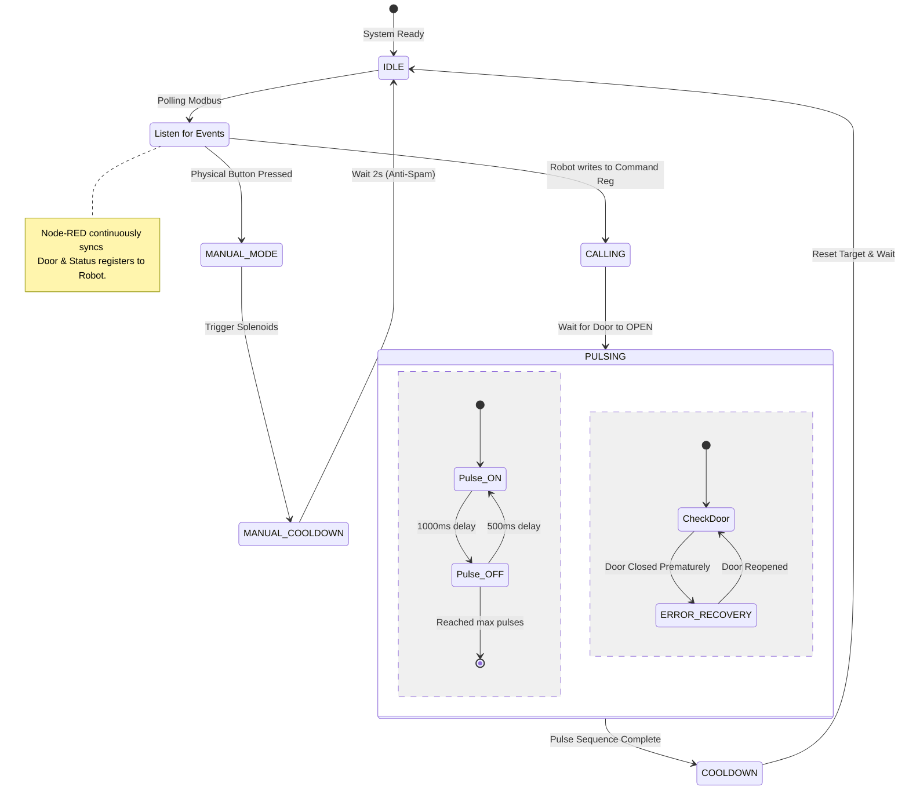
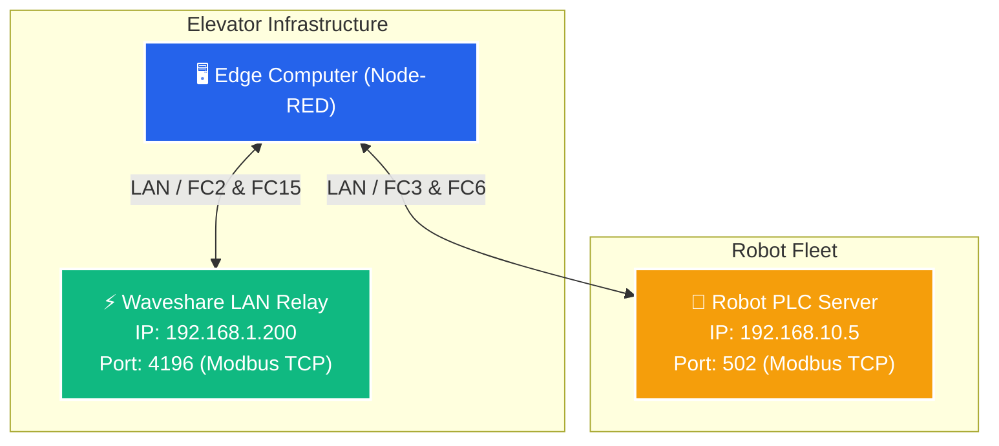

# Wave Share Node-RED Flow

This folder contains `flows_new.json`, a complete Node-RED flow that acts as the **Unified Elevator Manager & Status Loop** for the robot elevator system. It replaces the legacy Python scripts with a visual, event-driven state machine running directly in Node-RED.

## 🔄 Mission Workflow

Below is the state machine workflow executed by Node-RED when handling an autonomous robot elevator mission, as well as manual overrides.

## 🌐 Network Architecture & IP Configuration

The Node-RED Edge Gateway acts as the central orchestrator, communicating with the physical elevator hardware and the robot over the network.

## ⚙️ Configuration (Lift A vs Lift B)

The flow dynamically configures itself for **Lift A** or **Lift B** based on the global `lift_config.json` (specifically the `lift_id` parameter). The flow uses different Robot Modbus Holding Registers to prevent collisions when multiple lifts share the same Robot PLC Server (Port 502).

| Register Type | Lift A Address | Lift B Address | Description |
|---|---|---|---|
| **Floor** | `0` | `10` | The physical floor the elevator is currently on. |
| **Heartbeat** | `1` | `11` | Connection health check. |
| **Status** | `2` | `12` | Elevator availability (`1` = READY, `2` = BUSY). |
| **Command** | `3` | `13` | Mission trigger from the Robot. |
| **Door** | `4` | `14` | Door feedback to the Robot (`1` = OPEN, `2` = CLOSED). |
| **Target** | `6` | `16` | The destination floor commanded by the Robot. |

---

## 🔌 Device I/O Mapping

The flow communicates with two main devices: the **Waveshare LAN Relay** (Port 4196) and the **Robot Modbus Server** (Port 502).

### 1. Waveshare LAN Relay (Physical Elevator Hardware)
Reads physical inputs (Buttons, Sensors) via `FC2` (Read Discrete Inputs) and controls actuators (Solenoids, LEDs) via `FC15` (Write Multiple Coils).

**Discrete Inputs (Sensors & Buttons):**
- **Input 0 (Door Sensor):** Detects if the physical elevator door is open or closed. (Low-active by default, can be inverted via config).
- **Input 1 (Button UP):** Physical manual call button for UP. (With a 2-second anti-spam cooldown).
- **Input 2 (Button DOWN):** Physical manual call button for DOWN. (With a 2-second anti-spam cooldown).

**Coils (Actuators & Lights):**
- **Coil 0 (Solenoid UP):** Triggers the elevator's UP movement.
- **Coil 1 (Solenoid DOWN):** Triggers the elevator's DOWN movement.
- **Coil 2 (Button UP LED):** Indicator light for the UP button.
- **Coil 3 (Button DOWN LED):** Indicator light for the DOWN button.
- **Coil 5 (Tower Lamp - Normal):** Green light indicating Idle/Normal state.
- **Coil 6 (Tower Lamp - Active):** Yellow light indicating Active/Pulsing/Manual state.
- **Coil 7 (Tower Lamp - Error):** Red light indicating Error/Disconnected state.

### 2. Robot Modbus PLC (Autonomous Navigation)
The flow syncs the elevator's state with the robot. When the robot writes to the **Command** register, the Node-RED flow executes the "Pulse Engine", pulsing the solenoids `pulse_count` times (default 3), while continuously updating the **Door** and **Status** registers based on the physical Waveshare sensors.

## 🚀 Key Features of the Flow
- **Full Mission State Machine:** Manages states (IDLE, CALLING, PULSING, DONE, COOLDOWN, ERROR_RECOVERY).
- **Manual Cooldown:** 2-second rate-limit on physical button presses to prevent spamming.
- **Auto Recovery:** If the door closes prematurely during a pulsing phase, the flow pauses and resumes once the door reopens.
- **Dynamic Dashboard UI:** Includes an integrated Node-RED dashboard for monitoring telemetry, logs, and manual overrides.
